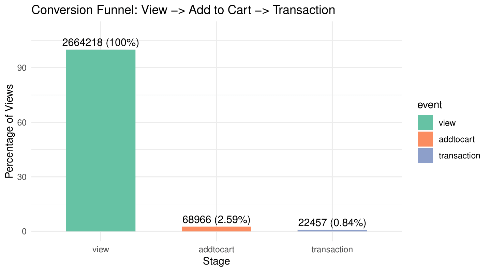

# RetailRocket E-commerce Customer Behavior Analysis

## Table of Contents

1. [Overview](#overview)  
2. [Business Questions](#business-questions)  
3. [Business Problem](#business-problem)  
4. [Tools & Skills](#tools--skills)  
5. [Dataset](#dataset)  
6. [Key Visualization](#key-visualization)  
7. [Insights & Takeaways](#insights--takeaways)  
8. [Limitations](#limitations)  
9. [Connect with Me](#connect-with-me)

## Project Overview
This project analyzes customer interaction data from an e-commerce platform using the RetailRocket dataset. The goal is to explore how users interact with products and identify patterns in browsing behavior, cart activity, and purchases.

Using R for data analysis, this project focuses on understanding customer engagement and identifying behaviors that may lead to higher conversion rates.

---

## Business Questions

1. Which products receive the most views?
2. How often do product views convert to add-to-cart actions?
3. What user behaviors are most associated with purchases?
4. Where in the conversion funnel do most users drop off?

---

## Business Problem
E-commerce companies collect large volumes of behavioral data, but turning that data into actionable insights can be challenging.

This analysis addresses questions such as:

- Which products receive the most views?
- How often do users move from viewing a product to adding it to their cart?
- What interaction patterns are associated with purchases?

Insights from this analysis can help businesses improve product recommendations, optimize marketing strategies, and increase customer engagement.

---

## Tools & Technologies

- R
- Data Cleaning
- Exploratory Data Analysis (EDA)
- Data Visualization

---

## Dataset

**RetailRocket E-commerce Dataset**

The dataset contains user interaction events, including:

- Product views
- Add-to-cart actions
- Purchases

These events allow analysis of how customers move through the purchasing journey on an e-commerce platform.

---

## Skills Demonstrated

- Data cleaning and preprocessing
- Exploratory data analysis
- Behavioral data analysis
- Data visualization
- R programming

---

## Key Visualization

**Figure:** Conversion funnel showing how users move from product views → add-to-cart → purchase. This chart highlights areas where customer engagement drops, helping businesses optimize their e-commerce strategy.

---

## Limitations

- The dataset is anonymized, so user demographic data is limited.  
- Analysis is based on historical data only; no predictive modeling was performed.  
- Insights may not generalize to other e-commerce platforms or indu

---

## Future Improvements

- Build a predictive model to estimate purchase probability
- Create an interactive dashboard using R Shiny or Power BI
- Perform session-level analysis of user journeys
- Include product-level recommendation insights

---

## Author

Ciana Ellington  
Data Analyst focused on using data to uncover insights and support business decision-making.

**Connect with me:** 

- **Portfolio:** [cianaellington.com](https://sites.google.com/view/cianaellington)  
- **LinkedIn:** [Ciana Ellington](https://www.linkedin.com/in/cianaellington-dataanalytics)

---

🔗 **View the full Kaggle notebook:**  
[Retail Rocket E-Commerce Capstone](https://www.kaggle.com/code/cianaellington/retail-rocket-ecommerce-capstone)
