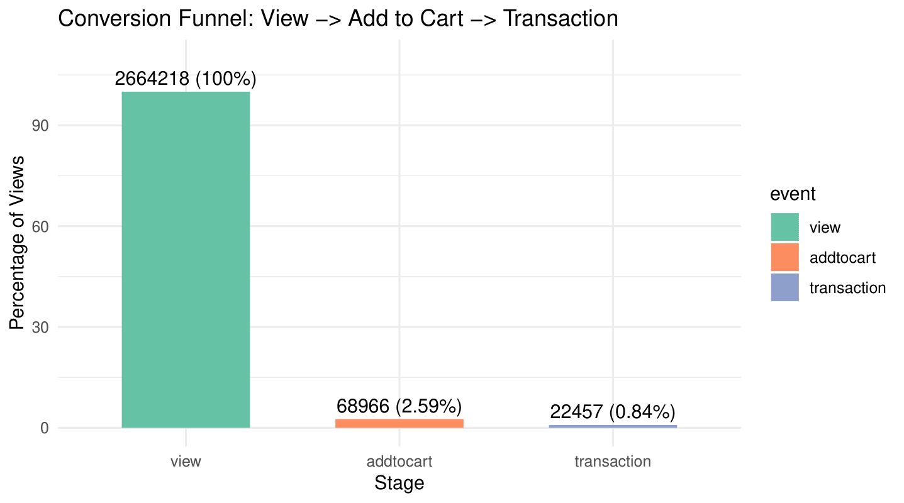

## 🛍️ Retail Rocket E-Commerce Behavior Analysis

### 📌 Project Overview
This project analyzes large-scale e-commerce behavioral data (product views, cart additions, and transactions) to understand how users interact with products and where drop-offs occur in the purchase journey.

The goal is to translate raw user interaction data into actionable business insights that can improve conversion rates, product engagement, and recommendation strategies.

---

### 🎯 Business Questions
This analysis is designed to answer:

- Where do users drop off in the e-commerce funnel?
- Which products receive high engagement but low conversions?
- What behaviors indicate strong purchase intent?
- How can product recommendations be improved using behavioral data?

---

### 📊 Dataset Description
The dataset contains anonymized user interaction events from an e-commerce platform, including:

- Product view events  
- Add-to-cart events  
- Transaction events  
- Product metadata (categories, item IDs)  
- User interaction timestamps  

This allows analysis of full customer journeys from discovery to purchase.

---

### 📈 Key Metrics Analyzed

- View → Cart conversion rate  
- Cart → Purchase conversion rate  
- Overall funnel drop-off rate  
- Product-level engagement vs conversion  
- Category-level performance  
- High-intent user behavior patterns  

---

### 🔎 Key Insights

- A significant portion of users drop off after viewing products but before adding to cart, suggesting a **top-of-funnel engagement issue**.

- Several high-traffic products show low conversion rates, indicating potential issues with **pricing, product clarity, or trust signals**.

- Certain product categories generate high engagement but low revenue contribution, highlighting opportunities for **better recommendation targeting**.

- Repeat engagement behavior suggests strong potential for **personalized recommendation systems**.
.

---

### Skills Demonstrated

- Data cleaning and preprocessing
- Exploratory data analysis
- Behavioral data analysis
- Data visualization
- R programming
- Behavioral segmentation  

---

## Key Visualization

**Figure:** Conversion funnel showing how users move from product views → add-to-cart → purchase. This chart highlights areas where customer engagement drops, helping businesses optimize their e-commerce strategy.

---

## Limitations

- The dataset is anonymized, so user demographic data is limited.  
- Analysis is based on historical data only; no predictive modeling was performed.  
- Insights may not generalize to other e-commerce platforms or industries.

---

## Future Improvements

- Build a predictive model to estimate purchase probability
- Create an interactive dashboard using R Shiny or Power BI
- Perform session-level analysis of user journeys
- Include product-level recommendation insights

---

## Author

Ciana Ellington  
Data Analyst focused on using data to uncover insights and support business decision-making.

**Connect with me:** 

- **Portfolio:** [cianaellington.com](https://sites.google.com/view/cianaellington)  
- **LinkedIn:** [Ciana Ellington](https://www.linkedin.com/in/cianaellington-dataanalytics)

